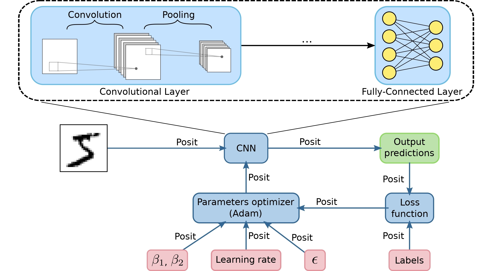

# Deep PeNSieve

**`Documentation`** |
------------------- |

[](https://doi.org/10.1016/j.dsp.2020.102762)|

Deep PeNSieve is a framework to entirely performing both training and inference of DNNs employing the [Posit Number System](http://www.johngustafson.net/pdfs/BeatingFloatingPoint.pdf).



## Supported on

* 64 bit machines
* Only tested on Linux

## Installation

Deep PeNSieve relies on other two libraires: [TensorFlow](https://www.tensorflow.org/) and [SoftPosit](https://gitlab.com/cerlane/SoftPosit-Python). TensorFlow framework needs to be [modified](https://github.com/xman/tensorflow) to support posit data type via software emulation.

At least TensorFlow must be installed to run Deep PeNSieve. If need to use fused operations, install SoftPosit too. You can install them, for example, using `pip`. First install the prerequisites:

```shell
$ pip install numpy-posit
$ pip install requests
```

And then, the required libraries:

```shell
$ pip install https://s3-ap-southeast-1.amazonaws.com/posit-speedgo/tensorflow_posit-1.11.0.0.0.1.dev1-cp36-cp36m-linux_x86_64.whl
$ pip install softposit
```

**Note:** To avoid incompatibility issues, make sure no other version of NumPy or TensorFlow are installed. I suggest creating a virtual environment.

## Usage

Try your first Deep PeNSieve program

```shell
$ python
```

```python
>>> import numpy as np
>>> import tensorflow as tf
>>> np.posit32(np.pi)
3.141593
>>> a = tf.constant(0.3, dtype=tf.posit8)
>>> b = tf.constant(0.7, dtype=tf.posit8)
>>> with tf.Session() as sess:
...     print(f'Using Posit8: {a.eval()} + {b.eval()} = {tf.add(a,b).eval()}')
...
Using Posit8: 0.296875 + 0.703125 = 1.0
```

## Source files

The actual source files of the project are stored inside the `src` folder. it contains three folders:  

* `TensorFlow`. Contains scripts for generating and training CN models.
* `SoftPosit`. Contains scripts for generating same models as in `TensorFlow` folder, and perform low-precision inference with 8-bit posits using quire and fused operations.
* `TF_Lite`. Contains scripts for creating TensorFlow Lite models from trained models on single-precision floating-point at `TensorFlow` folder.

## Contributing

Pull requests are welcome. For major changes, please open an issue first to discuss what you would like to change.

Please make sure to update tests as appropriate.

## Authors and credits

Deep PeNSieve is managed by Raul Murillo (contact: ramuri01@ucm.es).

The software uses NumPy, and relies heavily on [TensorFlow](https://www.tensorflow.org/) and [SoftPosit](https://gitlab.com/cerlane/SoftPosit-Python).

Deep PeNSieve is the result of our [paper](https://doi.org/10.1016/j.dsp.2020.102762).  If you find this code useful in your research, please consider citing:
> Raul Murillo, Alberto A. Del Barrio, and Guillermo Botella. "Deep PeNSieve: A deep learning framework based on the posit number system." Digital Signal Processing 102 (2020): 102762, doi: [10.1016/j.dsp.2020.102762](https://doi.org/10.1016/j.dsp.2020.102762).
```
@article{murillo2020deep,
  title={Deep PeNSieve: A deep learning framework based on the posit number system},
  author={Murillo, Raul and Del Barrio, Alberto A and Botella, Guillermo},
  journal={Digital Signal Processing},
  volume={102},
  pages={102762},
  year={2020},
  issn={1051-2004},
  doi={https://doi.org/10.1016/j.dsp.2020.102762},
  url={https://www.sciencedirect.com/science/article/pii/S105120042030107X},
  publisher={Elsevier}
}
```

This code was tested on an Ubuntu 18.04 system.

## License

[Apache License 2.0](LICENSE)

## Acknowledgements
This work has been supported by the Community of Madrid under grant S2018/TCS-4423, the EU (FEDER) and the Spanish MINECO under grant RTI2018-093684-B-I00 and by Banco Santander under grant PR26/16-20B-1.
